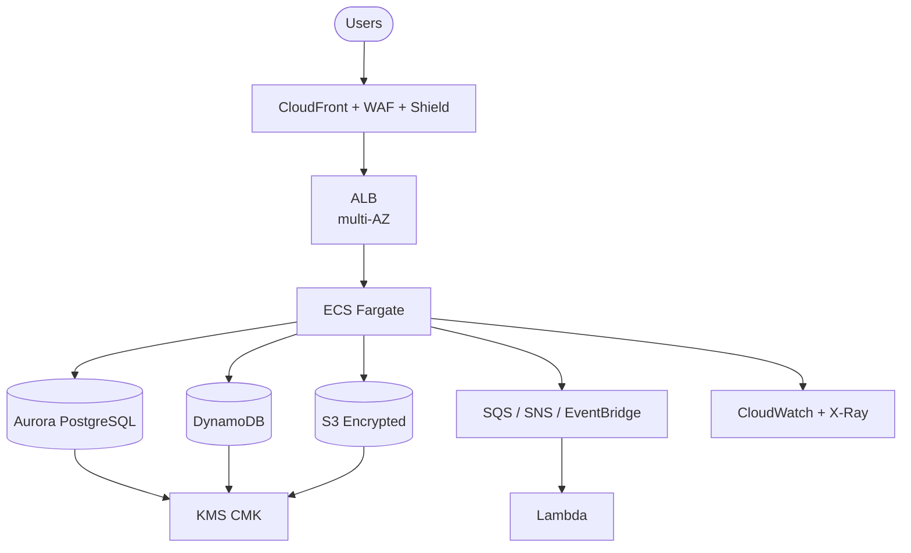

# Causeway Banking Financial

Production-grade AWS platform for Causeway Banking Financial digital services.

This repository is the single source of truth for architecture, infrastructure,
security, compliance, and operational standards. It contains working Terraform
modules, CI/CD pipelines, and a service template — everything a team needs to
ship a new financial service to production.

> **Domain:** `finance.causewaygrp.com`
> **Primary region:** eu-west-1 (Ireland) | **DR region:** eu-west-2 (London)
> **Compute:** ECS Fargate ([ADR-0001](docs/adr/0001-default-compute-ecs-fargate.md))

## Quick links

| What you need | Where to find it |
|---------------|------------------|
| Launch a new service | [service-template/](service-template/) |
| Understand the architecture | [docs/ARCHITECTURE.md](docs/ARCHITECTURE.md) |
| Deploy infrastructure | [infrastructure/](infrastructure/) |
| Go-live checklist | [docs/GO_LIVE_CHECKLIST.md](docs/GO_LIVE_CHECKLIST.md) |
| Respond to an incident | [docs/OPERATIONS_RUNBOOK.md](docs/OPERATIONS_RUNBOOK.md) |
| Prepare for a compliance audit | [docs/COMPLIANCE_MAPPING.md](docs/COMPLIANCE_MAPPING.md) |
| Report a security vulnerability | [SECURITY.md](SECURITY.md) |

## Architecture



Full diagrams including DR topology and network segmentation:
[docs/ARCHITECTURE.md](docs/ARCHITECTURE.md)

## Architecture decisions

| ADR | Decision | Status |
|-----|----------|--------|
| [0001](docs/adr/0001-default-compute-ecs-fargate.md) | ECS Fargate as default compute; Lambda for event-driven; EKS deferred | Accepted |
| [0002](docs/adr/0002-rto-rpo-targets-by-service-tier.md) | Three service tiers: Tier 1 (15min RTO, 99.95%) / Tier 2 (1hr, 99.9%) / Tier 3 (4hr, 99.5%) | Accepted |
| [0003](docs/adr/0003-cross-region-dr-strategy.md) | Active-passive DR (Tier 1), pilot light (Tier 2), backup-restore (Tier 3) | Accepted |

## Infrastructure

All infrastructure is Terraform, deployed via GitHub Actions.

```
infrastructure/
  modules/
    networking/       VPC, 3-tier subnets, NAT, NACLs, flow logs
    compute/          ECS Fargate, ALB (TLS 1.3), HTTP-to-HTTPS redirect
    data/             Aurora PostgreSQL, DynamoDB, S3 (KMS-encrypted)
    security/         KMS CMK, WAF (OWASP + SQLi + rate limiting), IAM
    observability/    CloudWatch dashboard, 5 alarms, SNS notifications
  environments/
    nonprod/          2 AZs, single NAT, relaxed thresholds
    prod/             3 AZs, NAT per AZ, 3 Aurora instances, strict thresholds
  shared/ci-cd/       GitHub OIDC, Terraform state buckets, IAM roles
  policy/             12 AWS Config rules for automated compliance
  cost-guardrails/    AWS Budgets, Cost Anomaly Detection, tag enforcement
  chaos-engineering/  AWS FIS experiments (ECS recovery, Aurora failover, CPU stress)
```

### Deployment pipeline

```
PR opened ──> terraform plan (both envs) ──> comment diff on PR
                                                    │
PR merged ──> auto-apply to nonprod ────────────────┘
                                                    │
Manual trigger ──> type "apply" ──> GitHub approval gate ──> apply to prod
```

Details: [docs/DEPLOYMENT.md](docs/DEPLOYMENT.md) |
Pipelines: [.github/workflows/](/.github/workflows/)

## Service template

Scaffold a new service with everything included:

```
service-template/
  app/
    Dockerfile          Multi-stage, non-root, health check
    src/server.ts       Express + Helmet + structured logging (pino)
    tsconfig.json       TypeScript strict mode
    jest.config.js      Test config with 80% coverage thresholds
  terraform/
    main.tf             ECS service, ALB target group, ECR, autoscaling
    variables.tf        Service tier (tier-1/2/3) determines infra sizing
  .github/workflows/
    ci.yml              Lint > typecheck > test > Docker build > Trivy scan > deploy
  tests/
    health.test.ts      Health/ready endpoint validation
```

Usage: copy the template, replace `{{service-name}}`, set `service_tier`, push.
See [service-template/README.md](service-template/README.md)

## Security and compliance

| Domain | Document | Summary |
|--------|----------|---------|
| Threat landscape | [THREAT_MODEL.md](docs/THREAT_MODEL.md) | STRIDE analysis: 24+ threats with mitigations |
| Compliance | [COMPLIANCE_MAPPING.md](docs/COMPLIANCE_MAPPING.md) | PCI-DSS v4.0, FCA SYSC, UK GDPR controls matrix |
| Data handling | [DATA_CLASSIFICATION.md](docs/DATA_CLASSIFICATION.md) | 4 tiers: Public, Internal, Confidential, Restricted |
| Security baseline | [AWS_PRODUCTION_READINESS.md](docs/AWS_PRODUCTION_READINESS.md) | 10-category production readiness checklist |
| Vulnerability reporting | [SECURITY.md](SECURITY.md) | Contact: security@causewaygrp.com |

### Policy-as-code

12 AWS Config rules enforce standards automatically:
encryption at rest, S3 public access blocks, multi-AZ databases, required tags,
CloudTrail, VPC flow logs, WAF association.
See [infrastructure/policy/](infrastructure/policy/)

## Operations

| Capability | Document | What it covers |
|------------|----------|----------------|
| Incident response | [OPERATIONS_RUNBOOK.md](docs/OPERATIONS_RUNBOOK.md) | 8 step-by-step procedures with CLI commands |
| Chaos engineering | [CHAOS_ENGINEERING.md](docs/CHAOS_ENGINEERING.md) | Monthly gamedays with AWS FIS |
| Cost management | [infrastructure/cost-guardrails/](infrastructure/cost-guardrails/) | Budgets, anomaly detection, tag enforcement |
| Service discovery | [backstage/](backstage/) | Backstage catalog + self-service scaffolding |

### Incident runbook coverage

| Scenario | Procedure |
|----------|-----------|
| ECS container crash loop | Stop conditions, task inspection, rollback |
| Aurora database failover | Promote replica, verify connections |
| TLS certificate expiry | Renew ACM, validate HTTPS |
| AWS region degradation | DR activation per ADR-0003 |
| Suspected data breach | Isolate, preserve evidence, notify regulators |
| DDoS attack | WAF escalation, Shield Advanced |
| Failed deployment | ECS circuit breaker rollback |
| Secrets rotation | Scheduled and emergency procedures |

## Getting started

### For platform engineers (deploy infrastructure)

1. Deploy `infrastructure/shared/ci-cd/` to create state buckets and OIDC roles.
2. Set GitHub secrets: `TERRAFORM_PLAN_ROLE_ARN`, `TERRAFORM_APPLY_ROLE_ARN`,
   `TERRAFORM_APPLY_ROLE_ARN_PROD`.
3. Create GitHub environments `nonprod` and `production` with protection rules.
4. Open a PR touching `infrastructure/` — the plan pipeline runs automatically.

### For service teams (launch a new service)

1. Copy `service-template/` into a new repository.
2. Replace `{{service-name}}` placeholders.
3. Set `service_tier` in `terraform/variables.tf` per [ADR-0002](docs/adr/0002-rto-rpo-targets-by-service-tier.md).
4. Complete the [go-live checklist](docs/GO_LIVE_CHECKLIST.md).
5. Push to `main` — CI builds, scans, and deploys to nonprod automatically.

### For architects (record decisions)

1. Copy `docs/adr/0000-template.md` to a new numbered file.
2. Follow the Context / Decision / Consequences structure.
3. Get review from `@Causeway-banking-financial/architecture`.

## Definition of done

A service is production-ready when:

- [ ] Service tier assigned and recorded ([ADR-0002](docs/adr/0002-rto-rpo-targets-by-service-tier.md))
- [ ] Threat model reviewed against [THREAT_MODEL.md](docs/THREAT_MODEL.md)
- [ ] Compliance controls verified per [COMPLIANCE_MAPPING.md](docs/COMPLIANCE_MAPPING.md)
- [ ] Multi-AZ resilience tested (minimum 2 AZs, 3 for Tier 1)
- [ ] CloudWatch dashboard and alarms configured
- [ ] Runbook procedures validated for this service
- [ ] Go-live checklist signed off ([GO_LIVE_CHECKLIST.md](docs/GO_LIVE_CHECKLIST.md))
- [ ] Chaos engineering gameday completed

## Repository map

```
.
├── docs/                          Standards and operational documentation
│   ├── ARCHITECTURE.md            Reference architecture (Mermaid diagrams)
│   ├── THREAT_MODEL.md            STRIDE-based threat model
│   ├── COMPLIANCE_MAPPING.md      PCI-DSS, FCA, UK GDPR controls
│   ├── CHAOS_ENGINEERING.md       Gameday strategy and FIS experiments
│   ├── AWS_PRODUCTION_READINESS.md  10-category production checklist
│   ├── DATA_CLASSIFICATION.md     4-tier data classification policy
│   ├── DEPLOYMENT.md              Deployment model and pipeline stages
│   ├── DOMAIN_SETUP.md            DNS and TLS for finance.causewaygrp.com
│   ├── GO_LIVE_CHECKLIST.md       Pre-launch validation with acceptance criteria
│   ├── OPERATIONS_RUNBOOK.md      8 incident procedures with CLI commands
│   ├── REPOSITORY_STANDARDS.md    Repository setup and workflow standards
│   └── adr/                       Architecture Decision Records
├── infrastructure/                Terraform modules and environments
│   ├── modules/                   Reusable: networking, compute, data, security, observability
│   ├── environments/              nonprod (2 AZ) and prod (3 AZ) configs
│   ├── shared/ci-cd/              GitHub OIDC, state buckets, IAM roles
│   ├── policy/                    12 AWS Config compliance rules
│   ├── cost-guardrails/           Budgets and anomaly detection
│   └── chaos-engineering/         AWS FIS experiment templates
├── service-template/              Scaffold for new services
│   ├── app/                       Dockerfile, TypeScript server, configs
│   ├── terraform/                 ECS service module with autoscaling
│   ├── .github/workflows/         CI/CD pipeline
│   └── tests/                     Health endpoint tests
├── backstage/                     Developer portal catalog and templates
├── .github/workflows/             Platform CI/CD (docs lint, Terraform plan/apply)
├── SECURITY.md                    Vulnerability reporting policy
├── CONTRIBUTING.md                Contribution guidelines
└── .editorconfig                  Code style (2-space indent, LF, UTF-8)
```

## Contributing

See [CONTRIBUTING.md](CONTRIBUTING.md). All changes require PR review from
[CODEOWNERS](.github/CODEOWNERS). Security-sensitive changes require
`@Causeway-banking-financial/security` approval.

## Support

Open an [issue](../../issues) with details, or contact the platform engineering
team directly.
