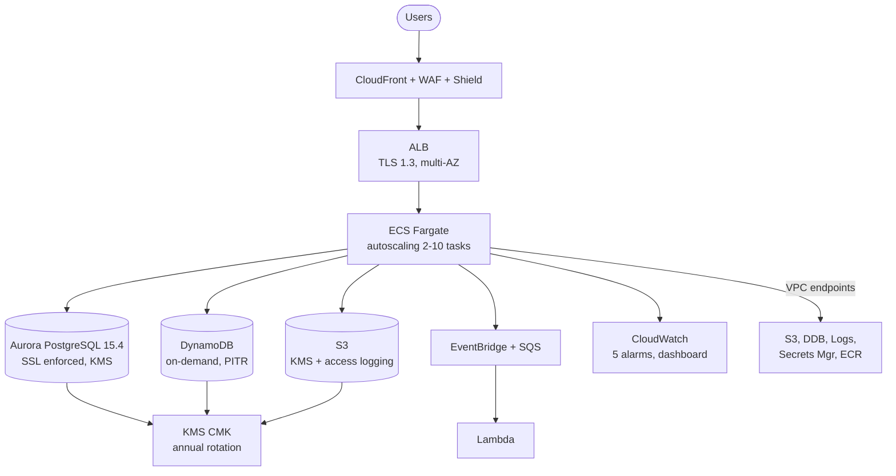

# Causeway Banking Financial

> **Last updated:** 2026-02-11 | **Audit grade:** B+ | **Status:** Nonprod-ready, prod hardening in progress

---

## What this repository is

This is the **complete infrastructure-as-code platform** for Causeway Banking
Financial. It provisions and manages a regulated financial services workload on
AWS, from network layer to application deployment.

This is **not** a documentation-only repository. It contains 3,640 lines of
working Terraform across 28 files, 4 CI/CD pipelines, a deployable service
template, and 5,141 lines of operational documentation across 25 markdown files.
Every Terraform module has been audited for security issues and the findings are
tracked in [docs/TECHNICAL_REVIEW.md](docs/TECHNICAL_REVIEW.md).

**What this repository does not yet contain:** application business logic, a
deployed production environment, or the data ingestion pipeline. Those are the
next phases. The infrastructure foundation is complete and audited.

| Fact | Value |
|------|-------|
| Total files | 76 |
| Terraform resources | 28 `.tf` files, 3,640 lines |
| CI/CD workflows | 4 platform + 1 service template |
| Documentation | 25 `.md` files, 5,141 lines |
| AWS Config compliance rules | 12 |
| CloudWatch alarms | 5 |
| WAF rule groups | 4 (OWASP CRS, Bad Inputs, SQLi, Rate Limit) |
| Chaos engineering experiments | 3 (ECS task stop, Aurora failover, CPU stress) |
| VPC endpoints | 6 (S3, DynamoDB, Logs, Secrets Manager, ECR API, ECR DKR) |
| Architecture decisions recorded | 3 ADRs |

> **Domain:** `finance.causewaygrp.com`
> **Primary region:** eu-west-1 (Ireland) | **DR region:** eu-west-2 (London)
> **Compute:** ECS Fargate ([ADR-0001](docs/adr/0001-default-compute-ecs-fargate.md))
> **Database:** Aurora PostgreSQL 15.4 (SSL enforced, KMS-encrypted, managed passwords)
> **Security contact:** security@causewaygrp.com

---

## What has been built (and what has not)

### Built and audited

- **Networking module** — VPC with 3-tier subnets (public/private/database), NAT
  gateways, NACLs restricting database tier to port 5432 only, VPC flow logs,
  6 VPC endpoints keeping AWS API traffic off the public internet
- **Compute module** — ECS Fargate cluster with FARGATE_SPOT support, ALB with
  TLS 1.3 policy (`ELBSecurityPolicy-TLS13-1-2-2021-06`), HTTP-to-HTTPS 301
  redirect, WAF association, security groups restricting ECS ingress to port 8080
- **Data module** — Aurora PostgreSQL with `rds.force_ssl=1` parameter group,
  managed master password (Secrets Manager + KMS), DynamoDB with PITR, S3 with
  KMS encryption + versioning + access logging + lifecycle policies
- **Security module** — KMS CMK with annual rotation, WAF Web ACL with 4 managed
  rule groups, WAF request logging, ECS execution IAM role scoped to service secrets
- **Observability module** — CloudWatch dashboard with 6 widgets (ALB requests,
  latency p50/p99, 4xx/5xx errors, ECS CPU/memory, Aurora CPU, Aurora connections),
  5 alarms with SNS notification
- **Policy-as-code** — 12 AWS Config rules checking encryption, public access,
  flow logs, multi-AZ, required tags, CloudTrail, WAF
- **Cost guardrails** — AWS Budgets at 50%/80%/100% thresholds, Cost Anomaly
  Detection, 70/30 prod/nonprod budget split, tag enforcement
- **Chaos engineering** — 3 AWS FIS experiments with CloudWatch alarm stop conditions
- **Service template** — TypeScript/Express app with Helmet, pino structured
  logging, 80% test coverage thresholds, Docker multi-stage build, Trivy scanning,
  auto-deploy to nonprod
- **CI/CD** — GitHub Actions with OIDC authentication (no long-lived AWS keys),
  terraform plan on PR, auto-apply nonprod, manual-approval prod

### Not yet built

- **Application business logic** — the service template is a scaffold; no domain
  services have been implemented yet
- **Data ingestion pipeline** — strategy is documented in the technical review
  (S3 landing zone, Step Functions, Lambda ETL, Aurora partitioned by year) but
  not yet implemented
- **Cross-region DR infrastructure** — documented in ADR-0003 but no eu-west-2
  resources exist in code
- **CloudTrail** — required by Config rules and compliance mapping, but the
  actual `aws_cloudtrail` resource is not provisioned
- **Secrets rotation** — Aurora uses managed passwords, but no rotation schedule
  is configured
- **PagerDuty/Slack integration** — runbooks reference escalation workflows that
  don't exist yet
- **API Gateway** — no API management layer; services are exposed directly via ALB

This is an honest accounting. The infrastructure foundation is solid. The items
above are the remaining work before production.

---

## Architecture



Full diagrams including DR topology and network segmentation:
[docs/ARCHITECTURE.md](docs/ARCHITECTURE.md)

### Architecture decisions

| ADR | Decision | Status |
|-----|----------|--------|
| [0001](docs/adr/0001-default-compute-ecs-fargate.md) | ECS Fargate as default compute; Lambda for event-driven; EKS deferred until >20 services | Accepted |
| [0002](docs/adr/0002-rto-rpo-targets-by-service-tier.md) | Tier 1: 15min RTO / 1min RPO / 99.95% — Tier 2: 1hr / 15min / 99.9% — Tier 3: 4hr / 1hr / 99.5% | Accepted |
| [0003](docs/adr/0003-cross-region-dr-strategy.md) | Active-passive (Tier 1), pilot light (Tier 2), backup-restore (Tier 3) in eu-west-2 | Accepted |

### Environment comparison

| Property | Nonprod | Prod |
|----------|---------|------|
| Availability zones | 2 (eu-west-1a, 1b) | 3 (eu-west-1a, 1b, 1c) |
| NAT gateways | 1 (shared, cost saving) | 3 (one per AZ, HA) |
| Aurora instances | 2 x db.r6g.medium | 3 x db.r6g.large |
| Backup retention | 7 days | 35 days |
| Deletion protection | Off | On |
| Container Insights | Off | On |
| Log retention | 30 days | 365 days |
| WAF rate limit | 5,000 req/5min/IP | 2,000 req/5min/IP |
| ALB 5xx alarm threshold | 50 | 5 |
| VPC CIDR | 10.0.0.0/16 | 10.1.0.0/16 |

---

## Infrastructure

All infrastructure is Terraform >= 1.5 with AWS provider ~> 5.0. Deployed via
GitHub Actions using OIDC federation — no long-lived AWS access keys anywhere.

```
infrastructure/
  modules/
    networking/       VPC, 3-tier subnets, NAT, NACLs, flow logs, 6 VPC endpoints
    compute/          ECS Fargate, ALB (TLS 1.3), HTTP-to-HTTPS redirect
    data/             Aurora PostgreSQL (SSL forced), DynamoDB (PITR), S3 (KMS + logging)
    security/         KMS CMK (rotation), WAF (4 rule groups), IAM execution role
    observability/    CloudWatch dashboard (6 widgets), 5 alarms, SNS
  environments/
    nonprod/          2 AZs, single NAT, relaxed thresholds
    prod/             3 AZs, NAT per AZ, 3 Aurora instances, strict thresholds
  shared/ci-cd/       GitHub OIDC provider, plan/apply IAM roles, state buckets + DynamoDB locks
  policy/             12 AWS Config rules for automated compliance enforcement
  cost-guardrails/    AWS Budgets (50/80/100% alerts), Cost Anomaly Detection, tag enforcement
  chaos-engineering/  3 AWS FIS experiments with alarm-based stop conditions
```

### Deployment pipeline

```
PR opened ──> terraform plan (both envs) ──> diff posted as PR comment
                                                    │
PR merged ──> auto-apply to nonprod ────────────────┘
                                                    │
Manual trigger ──> type "apply" ──> GitHub env approval gate ──> apply to prod
```

Details: [docs/DEPLOYMENT.md](docs/DEPLOYMENT.md) |
Pipelines: [.github/workflows/](/.github/workflows/)

### Security hardening applied

These fixes were applied during the 2026-02-11 deep audit:

| Fix | Why it matters |
|-----|---------------|
| Aurora SG egress removed | Databases have no reason to initiate outbound connections |
| Aurora parameter group: `rds.force_ssl=1` | All database connections must use SSL/TLS |
| Aurora parameter group: `log_statement=all` | Full SQL audit logging for compliance |
| S3 access logging bucket added | PCI-DSS requires access logging on sensitive data buckets |
| 6 VPC endpoints added | AWS API traffic stays inside the VPC (security + cost savings) |
| VPC flow log IAM scoped | IAM policy `Resource` changed from `*` to specific log group ARN |
| Service template: error handling middleware | Unhandled errors return structured JSON, no stack trace leaks |
| Service template: `require.main` guard | `app.listen()` only runs in production, not during test imports |
| Service template: supertest + eslint deps added | Tests and linting were broken without these dependencies |
| Trivy SARIF upload added | Vulnerability scan results now appear in GitHub Security tab |

### Known issues still open

| Issue | Severity | Tracking |
|-------|----------|----------|
| `terraform_apply` IAM role has `AdministratorAccess` | HIGH | Scope down to specific services before prod |
| No `aws_cloudtrail` resource provisioned | HIGH | Config rule checks for it but it doesn't exist |
| No Secrets Manager rotation schedule | MEDIUM | Aurora uses managed passwords but no rotation config |
| Docker base image not pinned to digest | MEDIUM | Supply chain risk — pin `node:20-alpine@sha256:...` |
| ECS task egress allows `0.0.0.0/0` | MEDIUM | VPC endpoints reduce exposure; further restrict per-service |
| Backstage not deployed | LOW | Catalog YAML exists but no running instance |

Full list: [docs/TECHNICAL_REVIEW.md](docs/TECHNICAL_REVIEW.md)

---

## Service template

A ready-to-deploy scaffold for new microservices:

```
service-template/
  app/
    Dockerfile               Multi-stage build, node:20-alpine, non-root user, healthcheck
    src/server.ts            Express 4.18 + Helmet + pino structured logging + error handler
    src/logger.ts            JSON logging with pino (fastest Node.js logger)
    .eslintrc.json           TypeScript ESLint with @typescript-eslint rules
    tsconfig.json            Strict mode, ES2022 target, CommonJS output
    jest.config.js           ts-jest, 80% branch/function/line/statement thresholds
    jest.integration.config.js  Extends base config for integration tests
    package.json             All deps declared including supertest for testing
  terraform/
    main.tf                  ECR (immutable tags, KMS), ECS task def, service with circuit breaker,
                             ALB target group, listener rule, CPU autoscaling (70% target)
    variables.tf             23 variables — service_tier validated to tier-1/tier-2/tier-3
    outputs.tf               Service URL, ECR repo URL, log group, task role ARN
  .github/workflows/
    ci.yml                   Lint > typecheck > test > Docker build > Trivy scan (SARIF) > deploy
  tests/
    health.test.ts           5 tests: /health, /ready, /, security headers, 404
```

**Usage:** Copy the template, replace `{{service-name}}`, set `service_tier`, push.

**What the CI pipeline does on every push:**
1. Installs dependencies (`npm install`)
2. Runs ESLint with TypeScript rules
3. Runs TypeScript type checker (`tsc --noEmit`)
4. Runs Jest with coverage (fails below 80%)
5. Builds Docker image (multi-stage, non-root)
6. Scans image with Trivy (fails on CRITICAL/HIGH CVEs)
7. Uploads SARIF results to GitHub Security tab
8. On merge to main: pushes to ECR, deploys to ECS nonprod

---

## Security and compliance

| Domain | Document | What it actually contains |
|--------|----------|--------------------------|
| Threat landscape | [THREAT_MODEL.md](docs/THREAT_MODEL.md) | STRIDE analysis with 24+ identified threats and specific mitigations |
| Compliance | [COMPLIANCE_MAPPING.md](docs/COMPLIANCE_MAPPING.md) | Control-by-control mapping to PCI-DSS v4.0, FCA SYSC, UK GDPR |
| Data handling | [DATA_CLASSIFICATION.md](docs/DATA_CLASSIFICATION.md) | 4 tiers: Public, Internal, Confidential, Restricted — with handling rules per tier |
| Security baseline | [AWS_PRODUCTION_READINESS.md](docs/AWS_PRODUCTION_READINESS.md) | 10 audit categories with specific requirements |
| Vulnerability reporting | [SECURITY.md](SECURITY.md) | security@causewaygrp.com, 2-day acknowledgement SLA |

### Policy-as-code (12 AWS Config rules)

These rules run continuously and alert on non-compliance via SNS:

| Rule | What it checks |
|------|---------------|
| `encrypted-volumes` | EBS volumes must use KMS encryption |
| `rds-storage-encrypted` | RDS instances must use KMS encryption |
| `s3-bucket-server-side-encryption-enabled` | S3 buckets must have SSE enabled |
| `s3-bucket-public-read-prohibited` | S3 buckets must not allow public read |
| `s3-bucket-public-write-prohibited` | S3 buckets must not allow public write |
| `rds-multi-az-support` | RDS instances must be multi-AZ |
| `vpc-flow-logs-enabled` | VPCs must have flow logs enabled |
| `cloud-trail-enabled` | CloudTrail must be active |
| `iam-root-access-key-check` | Root account must not have access keys |
| `required-tags` | Resources must have Project, Environment, ManagedBy tags |
| `alb-waf-enabled` | ALBs must have WAF Web ACL associated |
| `guardduty-enabled-centralized` | GuardDuty must be active |

---

## Operations

| Capability | Document | What it covers |
|------------|----------|----------------|
| Incident response | [OPERATIONS_RUNBOOK.md](docs/OPERATIONS_RUNBOOK.md) | 8 step-by-step procedures with actual CLI commands |
| Chaos engineering | [CHAOS_ENGINEERING.md](docs/CHAOS_ENGINEERING.md) | 3 FIS experiments, gameday strategy |
| Cost management | [infrastructure/cost-guardrails/](infrastructure/cost-guardrails/) | Budget alerts at 50/80/100%, anomaly detection |
| Service discovery | [backstage/](backstage/) | Backstage catalog YAML (instance not yet deployed) |

### Incident runbook procedures

| # | Scenario | Key steps |
|---|----------|-----------|
| 1 | ECS container crash loop | Inspect task stopped reason, check logs, rollback task definition |
| 2 | Aurora database failover | Verify replica promotion, check connection strings, test writes |
| 3 | TLS certificate expiry | Renew via ACM, validate HTTPS, check automation |
| 4 | AWS region degradation | Activate DR per ADR-0003, Route 53 failover, verify services |
| 5 | Suspected data breach | Isolate resources, preserve evidence, notify DPO within 72 hours |
| 6 | DDoS attack | Check WAF metrics, increase rate limiting, engage Shield Advanced |
| 7 | Failed deployment | ECS circuit breaker handles automatic rollback, verify via ALB health |
| 8 | Secrets rotation | Rotate in Secrets Manager, verify application reconnection |

---

## Deploying to AWS

### What you must provide

Create `terraform.tfvars` in each environment folder (see `.tfvars.example` files):

| Variable | Description | Where to get it |
|----------|-------------|-----------------|
| `acm_certificate_arn` | TLS certificate for your domain | `aws acm request-certificate --domain-name finance.causewaygrp.com --validation-method DNS` |
| `s3_bucket_suffix` | Globally unique string for S3 bucket names | Choose any unique string (e.g., your org + date) |
| `alarm_email` | Email for CloudWatch alarm notifications | Your ops team email |
| `cost_centre` | Billing tag (optional, defaults to `banking-financial`) | Your finance team |

### GitHub configuration required

| Item | Value |
|------|-------|
| Secret: `TERRAFORM_PLAN_ROLE_ARN` | Created by `shared/ci-cd` module |
| Secret: `TERRAFORM_APPLY_ROLE_ARN` | Created by `shared/ci-cd` module |
| Secret: `TERRAFORM_APPLY_ROLE_ARN_PROD` | Created by `shared/ci-cd` module (prod account) |
| Environment: `nonprod` | No approval gate |
| Environment: `production` | Manual approval gate, restricted reviewers |

### Deployment order (10 steps)

```
1. Deploy shared/ci-cd locally       ──> Creates OIDC provider, IAM roles, state buckets
2. Configure GitHub secrets           ──> TERRAFORM_PLAN_ROLE_ARN, TERRAFORM_APPLY_ROLE_ARN
3. Create GitHub environments         ──> nonprod (auto), production (manual approval)
4. Request ACM certificate            ──> DNS validation for finance.causewaygrp.com
5. Create nonprod/terraform.tfvars    ──> Fill in acm_certificate_arn, s3_bucket_suffix, alarm_email
6. Open PR touching infrastructure/   ──> terraform plan runs automatically, review diff
7. Merge PR                           ──> Auto-apply to nonprod
8. Validate nonprod                   ──> Check dashboards, run smoke tests
9. Create prod/terraform.tfvars       ──> Fill in production values
10. Trigger prod workflow manually    ──> Type "apply", GitHub approval, production deploy
```

Full guide: [docs/TECHNICAL_REVIEW.md](docs/TECHNICAL_REVIEW.md#4-aws-deployment-prerequisites)

---

## Data ingestion strategy (planned)

The technical review includes a complete data ingestion and backfill strategy
for importing historical financial data from 2010 to present:

- **S3 landing zone** — raw/validated/processed/failed prefix structure
- **Step Functions orchestration** — Lambda-based ETL (validate, transform, load)
- **Aurora partitioning** — tables partitioned by year for efficient historical queries
- **EventBridge + SQS** — real-time API ingestion for live data (2024-present)
- **Backfill priority** — P1: 2021-present (API + batch), P2: 2010-2020 (batch CSV)

This is a design, not yet implemented. See
[docs/TECHNICAL_REVIEW.md](docs/TECHNICAL_REVIEW.md#5-data-ingestion-and-backfill-strategy-2010present)
for the full strategy.

---

## Repository map

```
.
├── README.md                             This file (last updated: 2026-02-11)
├── SECURITY.md                           Vulnerability reporting (security@causewaygrp.com)
├── CONTRIBUTING.md                       Contribution guidelines
├── .editorconfig                         Code style: 2-space indent, LF, UTF-8
├── .gitignore                            Ignores .env, node_modules, .terraform, *.tfstate
├── .cspell.json                          Spell check dictionary for CI
├── .markdownlint.json                    Markdown linting rules
│
├── .github/
│   ├── CODEOWNERS                        @Causeway-banking-financial/{platform-engineering,architecture,security}
│   ├── ISSUE_TEMPLATE/                   Bug report + feature request templates
│   ├── PULL_REQUEST_TEMPLATE.md          PR checklist: security, ops, compliance
│   └── workflows/
│       ├── docs-lint.yml                 Markdown lint + spell check + link checking (every PR)
│       ├── terraform-plan.yml            Plan both envs on PR, post diff as comment
│       ├── terraform-apply-nonprod.yml   Auto-apply on merge to main
│       └── terraform-apply-prod.yml      Manual trigger + GitHub env approval gate
│
├── infrastructure/                       3,640 lines of Terraform
│   ├── modules/
│   │   ├── networking/                   VPC, subnets, NAT, NACLs, flow logs, 6 VPC endpoints
│   │   ├── compute/                      ECS Fargate, ALB (TLS 1.3), security groups
│   │   ├── data/                         Aurora PG (SSL forced), DynamoDB, S3 (KMS + logging)
│   │   ├── security/                     KMS CMK, WAF (4 rule groups), IAM
│   │   └── observability/                Dashboard (6 widgets), 5 alarms, SNS
│   ├── environments/
│   │   ├── nonprod/                      2 AZ, single NAT, db.r6g.medium, 7-day backup
│   │   └── prod/                         3 AZ, NAT per AZ, db.r6g.large, 35-day backup
│   ├── shared/ci-cd/                     OIDC provider, IAM roles, state buckets
│   ├── policy/                           12 AWS Config compliance rules
│   ├── cost-guardrails/                  Budgets (50/80/100%), anomaly detection
│   └── chaos-engineering/                3 FIS experiments (ECS, Aurora, CPU stress)
│
├── service-template/                     Deployable scaffold for new services
│   ├── app/                              TypeScript/Express, ESLint, Jest (80% coverage)
│   ├── terraform/                        ECR, ECS, ALB target group, autoscaling, outputs
│   ├── .github/workflows/ci.yml          Lint > test > Docker > Trivy > deploy
│   └── tests/                            5 supertest-based endpoint tests
│
├── backstage/                            Developer portal catalog (not yet deployed)
│   ├── catalog-info.yaml                 Backstage entities
│   └── README.md                         Setup instructions
│
└── docs/                                 5,141 lines of operational documentation
    ├── TECHNICAL_REVIEW.md               Full audit: scorecard, issues, deployment guide, data strategy
    ├── ARCHITECTURE.md                   3 Mermaid diagrams, component table, ADR references
    ├── DEPLOYMENT.md                     Pipeline flow, env configs, rollback strategy
    ├── GO_LIVE_CHECKLIST.md              20 items with acceptance criteria + evidence requirements
    ├── OPERATIONS_RUNBOOK.md             8 incident procedures with CLI commands
    ├── THREAT_MODEL.md                   STRIDE analysis, 24+ threats, mitigations
    ├── COMPLIANCE_MAPPING.md             PCI-DSS v4.0, FCA SYSC, UK GDPR controls matrix
    ├── DATA_CLASSIFICATION.md            4-tier classification policy
    ├── AWS_PRODUCTION_READINESS.md       10-category checklist
    ├── CHAOS_ENGINEERING.md              Gameday strategy, 3 FIS experiments
    ├── DOMAIN_SETUP.md                   DNS + TLS for finance.causewaygrp.com
    ├── REPOSITORY_STANDARDS.md           Repo setup and workflow standards
    └── adr/
        ├── 0000-template.md              ADR template
        ├── 0001-...ecs-fargate.md        ECS Fargate > EKS/Lambda
        ├── 0002-...rto-rpo-targets.md    3-tier SLA model
        └── 0003-...dr-strategy.md        Cross-region DR approach
```

---

## Technology stack

| Layer | Choice | Version | Rationale |
|-------|--------|---------|-----------|
| IaC | Terraform | >= 1.5 | Industry standard, mature AWS provider, remote state |
| Cloud | AWS | eu-west-1 (Ireland) | FCA-compliant region, data residency |
| Compute | ECS Fargate | — | No EC2 management, per-second billing, FARGATE_SPOT |
| Database | Aurora PostgreSQL | 15.4 | Managed HA, up to 5x throughput, automated failover |
| Sessions/Cache | DynamoDB | On-demand | Single-digit ms latency, PITR, KMS encrypted |
| Storage | S3 | — | KMS encrypted, versioned, lifecycle policies, access logging |
| Runtime | Node.js | 20 LTS | TypeScript, async/await, Alpine containers |
| Framework | Express | 4.18 | Battle-tested, Helmet security headers |
| Logging | Pino | 8.x | Fastest Node.js JSON logger, CloudWatch compatible |
| Testing | Jest + supertest | 29.x | 80% coverage gates, integration test support |
| Security scanning | Trivy | Latest | Container CVE scanning, SARIF output |
| WAF | AWS WAFv2 | — | OWASP CRS, SQLi, Bad Inputs, IP rate limiting |
| Monitoring | CloudWatch | — | Dashboard, alarms, log groups, metrics |
| Secrets | Secrets Manager | — | Managed rotation, KMS encrypted |
| CI/CD | GitHub Actions | — | OIDC auth, no long-lived keys, env approval gates |
| Policy | AWS Config | — | 12 continuous compliance rules |
| Chaos | AWS FIS | — | Managed fault injection, alarm-based stop conditions |

---

## Contributing

See [CONTRIBUTING.md](CONTRIBUTING.md). All changes require PR review from
[CODEOWNERS](.github/CODEOWNERS). Security-sensitive changes require
`@Causeway-banking-financial/security` approval.

## Pending: Yemen Economic Transparency Observatory

The `@Yemen-Economic-Transparency-Observatory (1).pdf` referenced in the project
brief has not yet been uploaded to this repository. If this document defines
additional requirements — such as specific economic indicators to ingest, public
API specifications, or transparency reporting standards — please upload it so
the platform design and data ingestion strategy can be updated to reflect those
requirements.

## Support

Open an [issue](../../issues) with details, or contact the platform engineering
team directly.
