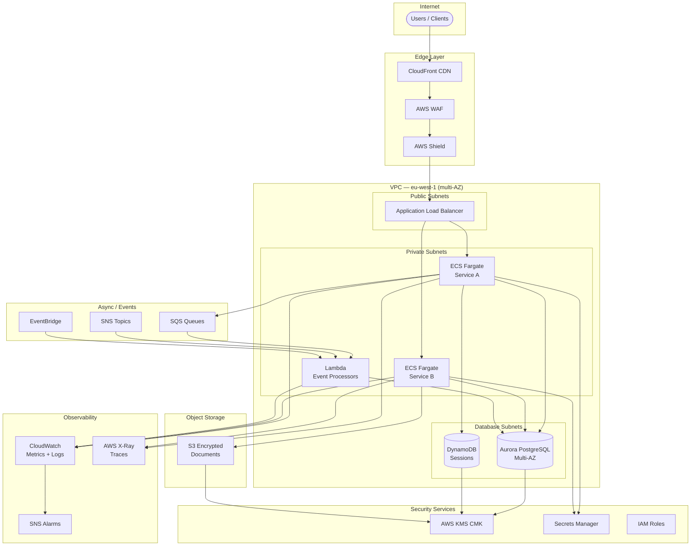
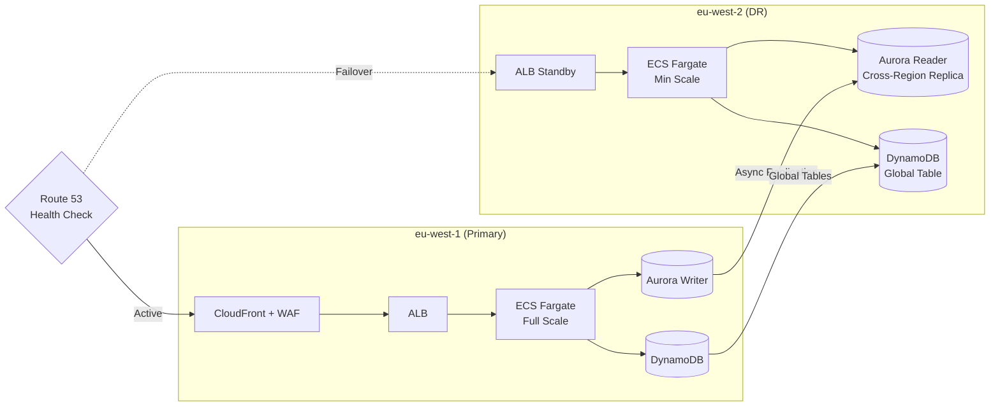
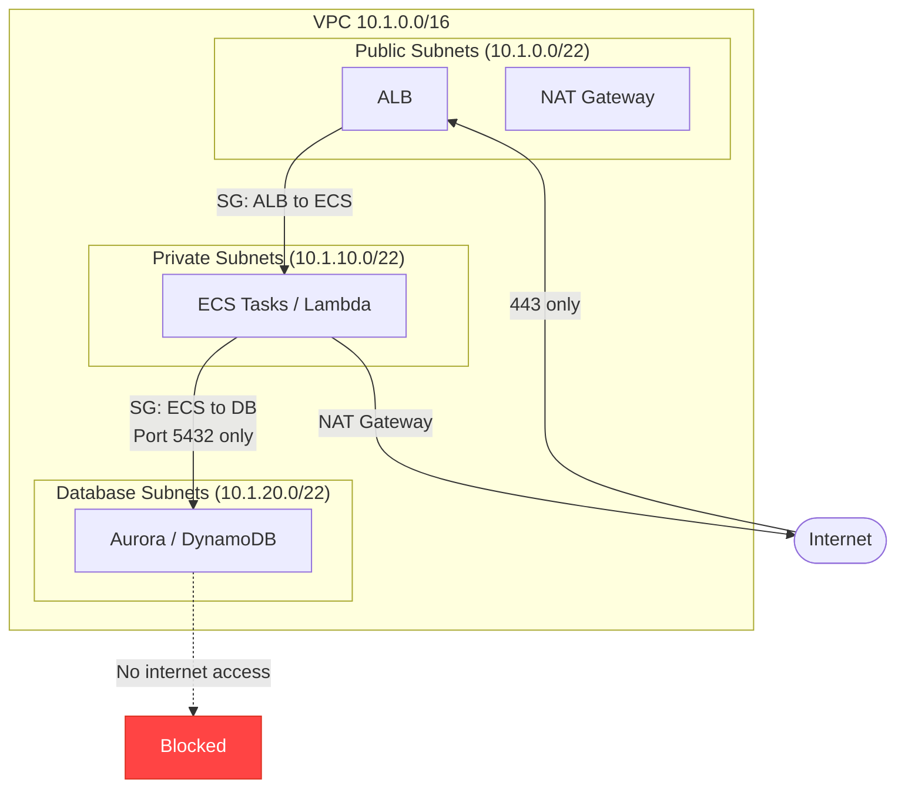

# Architecture

This document describes the reference architecture for Causeway Banking
Financial workloads hosted on AWS. It is a baseline that each service can
extend while maintaining security and operational consistency.

## Context

The platform supports customer-facing and internal systems that handle
confidential financial data. The design prioritizes confidentiality,
availability, and auditability.

## Reference architecture

## Disaster recovery topology

## Network segmentation

## Core components

| Layer | Service | Purpose |
|-------|---------|---------|
| Edge | CloudFront, AWS WAF, Shield | CDN, OWASP protection, DDoS mitigation |
| Ingress | Application Load Balancer | TLS termination, multi-AZ routing |
| Compute | ECS Fargate (default) | Containerised services — see [ADR-0001](adr/0001-default-compute-ecs-fargate.md) |
| Compute | Lambda | Event-driven processors (SQS, S3, scheduled) |
| Data | Aurora PostgreSQL | Relational data, multi-AZ, encrypted with KMS |
| Data | DynamoDB | Key-value / session data, global tables for DR |
| Data | S3 | Document and object storage, versioned, encrypted |
| Async | SQS, SNS, EventBridge | Decoupled event processing |
| Security | KMS, IAM, Secrets Manager | Encryption, access control, secrets |
| Observability | CloudWatch, X-Ray | Metrics, logs, distributed tracing |

## Data flow and boundaries

- All inbound traffic terminates TLS at the edge and is re-encrypted internally.
- Sensitive data remains in private subnets with no direct internet access.
- Service-to-service calls use mutual TLS where required.
- Database subnets are restricted by NACLs to accept connections only from
  private subnets on port 5432.

## Availability and scaling

- All tiers run in at least two availability zones (three in prod).
- ECS services use target-tracking autoscaling on CPU utilisation (target 70%).
- Aurora uses read replicas for read scaling and cross-region replicas for DR.
- Stateless services preferred for rapid recovery and horizontal scaling.

## Resolved decisions

The following decisions are recorded as Architecture Decision Records in `docs/adr/`:

- **Compute platform:** ECS Fargate is the default. Lambda is permitted for
  event-driven workloads. EKS is deferred. See [ADR-0001](adr/0001-default-compute-ecs-fargate.md).
- **RTO/RPO targets:** Three service tiers with targets ranging from 15min/1min
  (Tier 1) to 4hr/1hr (Tier 3). See [ADR-0002](adr/0002-rto-rpo-targets-by-service-tier.md).
- **DR strategy:** Active-passive warm standby for Tier 1, pilot light for
  Tier 2, backup-and-restore for Tier 3. Primary region eu-west-1, DR region
  eu-west-2. See [ADR-0003](adr/0003-cross-region-dr-strategy.md).
