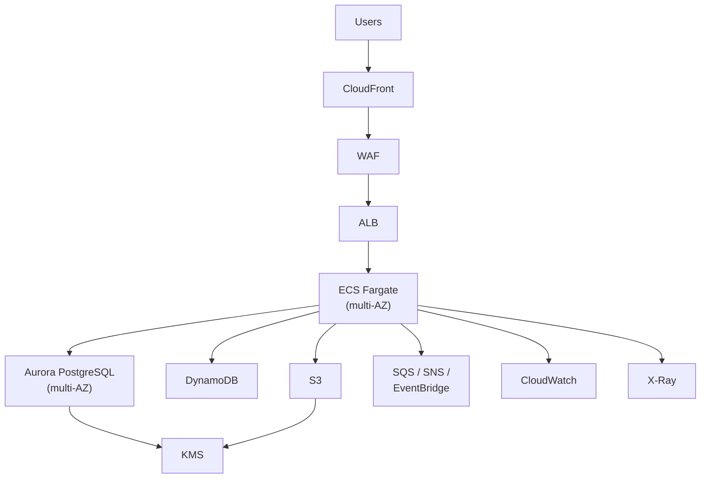

# Repository Review — Causeway Banking Financial

**Review date:** 2026-02-11
**Scope:** Full repository audit — structure, documentation quality, security posture, operational readiness, and architectural completeness.

---

## Executive Summary

This repository is a **documentation-first reference architecture** for hosting financial workloads on AWS under the Causeway Banking Financial brand. It contains **zero application code** — 19 files total, all markdown documentation, GitHub templates, and editor configuration.

The documentation itself is professionally written and covers the right topics for a regulated financial services platform. However, the repository has **critical gaps that would block any real production deployment**: placeholder identities in CODEOWNERS, no security contact, no CI/CD pipelines, no infrastructure-as-code, and unresolved architectural decisions.

**Overall grade: C+**
Well-intentioned standards documentation that currently serves as a skeleton, not a production-ready foundation.

---

## 1. What the Repository Gets Right

### Strong documentation-first philosophy
Writing standards before code is the correct approach for regulated financial services. This prevents teams from shipping first and retrofitting compliance later.

### Correct topic coverage
The docs cover the areas that matter for a financial platform on AWS:
- Architecture reference with clear data flow
- Production readiness checklist (10 categories)
- Data classification (4 tiers: Public, Internal, Confidential, Restricted)
- Deployment model with environment separation
- Incident response with severity levels
- Go-live checklist
- Domain and TLS setup for `finance.causewaygrp.com`

### Reasonable GitHub configuration
- Issue templates (bug report + feature request)
- PR template with security/operations impact review
- EditorConfig for consistent formatting
- Comprehensive .gitignore covering Node, Python, Terraform, and IDE files

---

## 2. Critical Issues (Must Fix Before This Repo Has Value)

### 2.1 CODEOWNERS is a placeholder — no actual access control

**File:** `.github/CODEOWNERS`

```
* @your-github-handle
/docs/ @your-docs-owner
/infrastructure/ @your-platform-owner
/.github/ @your-platform-owner
```

Every owner is a placeholder. If branch protection rules require CODEOWNERS approval, this either fails (handles don't exist) or provides zero governance. This is the single most important file for repository governance and it is non-functional.

**Severity:** CRITICAL

### 2.2 SECURITY.md has no security contact

**File:** `SECURITY.md`

> "Send a report to the security contact listed by the repository owners."

No email, no PGP key, no link to a disclosure program. A vulnerability reporter has nowhere to go. For a financial services repository, this is unacceptable.

**Severity:** CRITICAL

### 2.3 Three architectural decisions are explicitly unresolved

**File:** `docs/ARCHITECTURE.md` lines 44-47

```
- Final compute choice per service (ECS/EKS/Lambda)
- RTO/RPO targets by service tier
- Cross-region DR activation strategy
```

These aren't minor details — they are foundational decisions that determine infrastructure cost, operational complexity, and disaster recovery posture. No team can implement anything until these are resolved.

**Severity:** HIGH

### 2.4 Zero CI/CD pipeline configuration

There is no `.github/workflows/` directory. The repository documents that pipelines should have plan, build, test, deploy, and verify stages, but provides no implementation whatsoever. There is no linting of the markdown, no link checking, no validation of any kind.

**Severity:** HIGH

### 2.5 Zero infrastructure-as-code

The `infrastructure/` directory contains only a README describing a recommended folder layout:

```
infrastructure/
  modules/
  environments/
    nonprod/
    prod/
  shared/
```

None of these directories exist. There is no Terraform, no CDK, no CloudFormation — not even a skeleton. The repository tells teams to "use IaC for all resources" but provides nothing to start from.

**Severity:** HIGH

---

## 3. Documentation Quality Audit

### What is well-written
- `AWS_PRODUCTION_READINESS.md` — the strongest document; covers 10 audit areas with concrete requirements
- `DEPLOYMENT.md` — clear pipeline stages and environment separation model
- `DATA_CLASSIFICATION.md` — clean 4-tier classification with appropriate controls per level

### What is too shallow to be useful

| Document | Problem |
|----------|---------|
| `OPERATIONS_RUNBOOK.md` | Defines severity levels but contains zero actual runbook procedures. No "if X happens, do Y" playbooks. |
| `GO_LIVE_CHECKLIST.md` | Lists categories but every item is a vague checkbox. No definition of "done" for any item. |
| `ARCHITECTURE.md` | A 48-line document for the architecture of a financial platform is insufficient. No diagrams, no data model, no service boundaries. |
| `CONTRIBUTING.md` | Standard boilerplate. Doesn't address how to propose changes to standards themselves. |
| `infrastructure/README.md` | Describes what should exist but provides nothing. |

### Missing documentation entirely
- **Threat model** — Required for any financial services platform. What are the attack vectors? What are the trust boundaries?
- **Compliance mapping** — Which specific regulations apply (PCI-DSS, SOX, FCA)? How do the controls map to regulatory requirements?
- **Service catalog** — What services will this platform host? What are their tiers and SLAs?
- **Cost model** — No budget guidance, no cost allocation strategy beyond "use tags"
- **Team topology** — Who owns what? What are the team boundaries and responsibilities?
- **API standards** — No guidance on API design, versioning, authentication patterns
- **Testing strategy** — Beyond "run tests in CI," no guidance on test types, coverage expectations, or test data management

---

## 4. Security Posture Assessment

### Documented well
- Encryption at rest (KMS CMKs) and in transit (TLS 1.2+)
- Network segmentation (private subnets, VPC boundaries)
- Secrets management (Secrets Manager, no secrets in git)
- Identity (SSO, MFA, least privilege, no long-lived keys)
- Edge protection (WAF, Shield, rate limiting)

### Missing or inadequate

| Gap | Risk |
|-----|------|
| No threat model | Cannot prioritize security controls without understanding threats |
| No WAF rule specification | "Use WAF" without specifying which managed rule groups, custom rules, or rate limits |
| No SAST/DAST tool selection | Documents say "apply SAST/DAST" but don't specify tools or integration points |
| No supply chain security | No mention of artifact signing, SBOM generation, or provenance attestation |
| No secrets rotation specifics | Says "rotation policy" but no rotation intervals or automation guidance |
| No penetration testing cadence | Financial services typically require annual or quarterly pen tests |
| No data residency requirements | No mention of where data must stay geographically |
| No encryption key management lifecycle | KMS mentioned but no key rotation schedule, key hierarchy, or access policies |

---

## 5. Operational Readiness Assessment

### The good
- Multi-AZ requirement (minimum 2 AZs) is correct
- Environment isolation (separate accounts) is best practice
- Incident severity tiers (Sev 1-3) are defined

### The gaps

| Area | Current state | What is needed |
|------|---------------|----------------|
| SLOs | "Define SLOs per service" | Actual SLO targets (99.9%? 99.95%? Error budgets?) |
| Alert thresholds | Not specified | Concrete thresholds: latency p99, error rate %, CPU/memory % |
| On-call | "Rota and escalation defined" | Who, what hours, what tools (PagerDuty, Opsgenie?) |
| Dashboards | Not specified | What to monitor, what queries to run, what graphs to build |
| Backup retention | "Automated, tested" | Retention periods per data tier, RPO per service |
| Runbook procedures | High-level only | Step-by-step procedures for at least: service crash, database failover, certificate expiry, dependency outage, data breach |
| Capacity planning | Not mentioned | How to forecast growth, when to scale, cost implications |
| Chaos engineering | Not mentioned | Gameday frequency, failure injection strategy |

---

## 6. What I Would Do If I Were Building This Repository

### Phase 1: Fix the foundation (immediate)

**1. Replace every placeholder with real values.**
CODEOWNERS must have actual GitHub team handles. SECURITY.md must have a real email. The repository should not contain a single `@your-*` placeholder.

**2. Resolve the three open architectural decisions and record them as ADRs.**
- Pick ECS Fargate as the default compute (simpler ops than EKS, more flexible than Lambda for financial services).
- Define RTO/RPO: Sev 1 services get RTO 15min / RPO 1min (Aurora with replicas), Sev 2 services get RTO 1hr / RPO 15min.
- Define DR strategy: Active-passive in a second region with automated failover for Sev 1, manual for Sev 2.

**3. Add a CI pipeline that validates the documentation itself.**
```yaml
# .github/workflows/docs-lint.yml
- Markdown linting (markdownlint)
- Link checking (lychee or markdown-link-check)
- Spell checking (cspell)
- EditorConfig validation
```

This enforces quality on the one thing this repo actually contains.

### Phase 2: Add real infrastructure (weeks 1-2)

**4. Create a Terraform foundation module.**
```
infrastructure/
  modules/
    networking/         VPC, subnets, security groups, NAT
    compute/            ECS cluster, task definitions, ALB
    data/               Aurora, DynamoDB, S3 buckets
    security/           KMS keys, IAM roles, WAF rules
    observability/      CloudWatch dashboards, alarms, log groups
  environments/
    nonprod/
      main.tf           Composes modules for dev/staging
      variables.tf
      backend.tf        S3 + DynamoDB state backend
    prod/
      main.tf           Composes modules for production
      variables.tf
      backend.tf
  shared/
    logging/            Central log archive account
    ci-cd/              GitHub OIDC role for Actions
```

Ship a working VPC + ECS cluster + ALB + Aurora stack that teams can clone and extend. A reference architecture without reference code is just a wishlist.

**5. Add a GitHub Actions deployment pipeline.**
```
.github/workflows/
  docs-lint.yml              Lint docs on every PR
  terraform-plan.yml         Plan on PR, comment diff
  terraform-apply-nonprod.yml  Apply to nonprod on merge to main
  terraform-apply-prod.yml     Apply to prod with manual approval
```

### Phase 3: Make the docs operational (weeks 2-3)

**6. Write a real threat model.**
Using STRIDE or similar. Identify: spoofing (auth bypass), tampering (data modification), repudiation (audit log gaps), information disclosure (data leaks), denial of service (DDoS, resource exhaustion), elevation of privilege (IAM misconfiguration).

**7. Write real runbook procedures.**
At minimum, step-by-step playbooks for:
- Service container crash loop
- Aurora database failover
- TLS certificate approaching expiry
- AWS region degradation
- Suspected data breach response
- DDoS attack mitigation
- Failed deployment rollback
- Secrets rotation (scheduled and emergency)

**8. Create a service template repository.**
A `cookiecutter` or `copier` template that generates a new service repo with:
- Dockerfile following best practices (multi-stage, non-root user, health check)
- Terraform module that plugs into the shared infrastructure
- CI/CD pipeline pre-configured
- Test harness (unit + integration)
- README following the standards

**9. Add architecture diagrams.**
Replace the ASCII art with proper diagrams using Mermaid (renders natively in GitHub):



**10. Add compliance mapping.**
Create a matrix that maps each control in `AWS_PRODUCTION_READINESS.md` to specific regulatory requirements (PCI-DSS sections, SOX controls, FCA rules) with evidence collection pointers.

### Phase 4: Mature the platform (ongoing)

**11. Implement policy-as-code.**
Use Open Policy Agent (OPA) or AWS Config Rules to automatically enforce the standards documented in this repo. Don't rely on humans reading markdown — encode the rules so they are machine-enforceable.

**12. Add cost guardrails.**
AWS Budgets, cost anomaly detection, and a tagging enforcement policy. Financial services platforms can rack up costs quickly with Aurora, NAT gateways, and cross-AZ traffic.

**13. Implement chaos engineering.**
Schedule monthly gamedays using AWS Fault Injection Simulator. Test the multi-AZ failover, the autoscaling policies, and the runbook procedures under realistic conditions.

**14. Create an internal developer portal.**
Use Backstage or a similar tool to make these standards discoverable, track service ownership, and provide self-service scaffolding for new services.

---

## 7. Summary Scorecard

| Category | Score | Notes |
|----------|-------|-------|
| **Documentation coverage** | 7/10 | Right topics, insufficient depth |
| **Documentation quality** | 6/10 | Professional tone, too many vague statements |
| **Security posture** | 4/10 | Good principles, no implementation, no threat model |
| **Operational readiness** | 3/10 | Defines what should exist, provides nothing usable |
| **Infrastructure code** | 1/10 | Empty directory with a README |
| **CI/CD** | 0/10 | Nothing exists |
| **GitHub configuration** | 5/10 | Templates exist, CODEOWNERS is broken |
| **Compliance readiness** | 3/10 | Data classification exists, no regulatory mapping |
| **Developer experience** | 2/10 | No service template, no examples, no quickstart |
| **Production viability** | 1/10 | Cannot deploy anything from this repo today |

**Weighted overall: C+**

The intent is correct. The execution is incomplete. This repository needs to transition from describing what should be built to actually providing the building blocks.

---

## 8. Top 5 Priorities (Ordered)

1. **Fix CODEOWNERS and SECURITY.md** — governance fundamentals
2. **Resolve open architecture decisions, record as ADRs** — unblock all downstream work
3. **Ship a working Terraform foundation** — make the architecture real
4. **Add CI/CD pipelines** — automate quality enforcement
5. **Write concrete runbooks and threat model** — make operational readiness real
